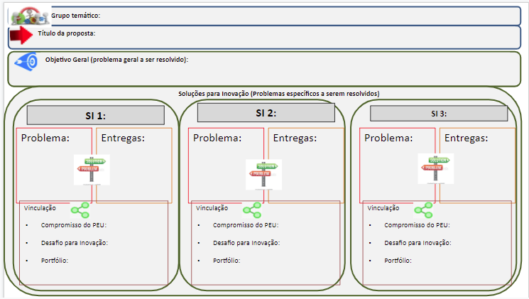

 

# 1) WORKSHOP RECURSOS NATURAIS

 

## OBJETIVO

Internalizar os compromissos do **Plano de Execução da Unidade (PEU)**, vinculados ao *VII PDE*.

 

{width=85%}
 

## META 

A partir da compreensão dos compromissos da Embrapa Semiárido, elaborar (ao menos) um esboço de proposta de projeto de PD&I, criada de forma colaborativa pelo grupo.

 

## EXEMPLO DA PROPOSTA
 

{width=85%}

 

Grupo Temático                   |   |           |   
---------------------------------|---|-----------|
                                 |   |           |
 **Título da Proposta**          |   |           |   
 **Problema Geral a ser resolvido:** |   |           |   
                                 |   |           |   
 **Solução para Inovação 1**     |   |           |   
 **Problema**                    |   | **Entregas:**|
                                 |   |           |   
                                 |   |           |   
                                 |   |           |   
                                 |   |           |   
                                 |   |           |   
 *Vinculação*                    |   |           |   
 *Compromisso do PEU:*           |   |           |   
 *Desafio Inovação:*             |   |           |   
 *Portfólio:*                    |   |           |                

# 2) COMPROMISSOS E DESAFIOS

## 2.1) Até 2025, promover a conservação e a disponibilização da agrobiodiversidade e de recursos do bioma Caatinga utilizando tecnologias sociais de desenvolvidas ou aprimoradas pela Embrapa.

### *Desafio: Viabilizar sistemas de produção de espécies frutíferas, de forrageiras, culturas anuais e de fibras em áreas agrícolas com déficit hídrico, solos arenosos e de baixa fertilidade natural na Região Nordeste (Portfólio: Convivência com a Seca)*

 

## 2.2) Aumentar em 2% a adoção de tecnologias que promovam o uso racional de recursos naturais do bioma Caatinga com base no conhecimento sobre as dinâmicas das interações solo-planta-atmosfera, a ciclagem de nutrientes e de água no Bioma Caatinga, até 2025.

### *Desafio: Viabilizar a multifuncionalidade da paisagem pela ampliação de serviços ambientais em áreas de produção agropecuária e florestal (Portfólio: Serviços Ambientais)*

 

## 2.3) Desenvolver e promover a adoção de critérios para a recomendação de irrigação de fruteiras cultivadas no Semiárido adequadas às diferentes fases de desenvolvimento que resultem na obtenção de frutos de alta qualidade e redução da pegada hídrica da cultura, gerando benefícios econômicos de R$ 2 milhões de reais até 2025.

### *Desafio: Aumentar a eficiência da irrigação nos cultivos de açaí, acerola, banana, caju, citros, coco, mamão, manga, maracujá e uva nas regiões Centro-Oeste, Nordeste e Norte (Portfólio:	Fruticultura Tropical)*

 

## 2.4) Desenvolver e promover a adoção de soluções para a inovação para o cultivo de Lippia grata, espécie nativa do bioma Caatinga com potencial farmacêutico e agrícola, baseada na recomendação de processo agropecuário de adubação e colheita da cultura para a obtenção de produtividade de 10 toneladas/hectare, até 2025.

### *Desafio: Alavancar o mercado de produtos certificados da biodiversidade florestal em sistemas sustentáveis nos diversos biomas brasileiros (Portfólio: Florestal)*

 

## 2.5) Desenvolver e promover a adoção de um produto contendo ativos obtidos de extratos vegetais e/ou óleos essenciais para uso na agropecuária para o controle de doenças de plantas e animais, até 2025.

### *Desafio: Aumentar a participação de insumos biológicos no controle de pragas, promoção do crescimento, suprimento de nutrientes, substituição de antibióticos e aplicação agroindustrial em sistemas de produção convencional e de base ecológica (Portfólio: Insumos Biológicos)*

 

## 2.6) Desenvolver e validar tecnologias que permitam o aumento da eficiência de uso da água em sistemas agrícolas no Semiárido brasileiro com a definição de critérios de recomendação de irrigação e automação da coleta e integração de informações, permitindo benefício econômico de R$ 5 milhões até 2025.

### *Desafio: Aumentar a eficiência de uso de água em cultivos irrigados de grãos, hortaliças, frutíferas, pastagens, cana-de-açúcar, palmeiras e plantas para produção de fibras e madeira (Portfólio: Agricultura Irrigada)*

 

## 2.7) Promover até 2025 a adoção de soluções de inovação que permitam o aumento da produtividade de apiários e a redução da perda de abelhas junto a produtores de mel com benefício econômico de um milhão de reais em regiões produtoras do Vale do São Francisco.

### *Desafio: Agregar valor ao pólen, própolis e mel e valorar o serviço de polinização das abelhas nos sistemas de produção dos biomas Amazônia, Mata Atlântica, Cerrado, Pantanal e Caatinga (Portfólio: Recursos Genéticos)*

 

# 3) COMPROMISSOS DA EMBRAPA SEMIÁRIDO COMO LÍDER

 Compromissos                                                                                                                                                                                                                                                                                                                             | Embrapa Semiárido 
:----------------------------------------------------------------------------------------------------------------------------------------------------------------------------------------------------------------------------------------------------------------------------------------------------------------------------------------:|:-----------------:
 Até 2025, promover a conservação e a disponibilização da agrobiodiversidade e de recursos do bioma Caatinga utilizando tecnologias sociais de desenvolvidas ou aprimoradas pela Embrapa.                                                                                                                                                 | Líder             
 Aumentar em 2% a adoção de tecnologias que promovam o uso racional de recursos naturais do bioma Caatinga com base no conhecimento sobre as dinâmicas das interações solo-planta-atmosfera, a ciclagem de nutrientes e de água no Bioma Caatinga, até 2025.                                                                              | Líder             
 Desenvolver e promover a adoção de critérios para a recomendação de irrigação de fruteiras cultivadas no Semiárido adequadas às diferentes fases de desenvolvimento que resultem na obtenção de frutos de alta qualidade e redução da pegada hídrica da cultura, gerando benefícios econômicos de R$ 2 milhões de reais até 2025. | Líder             
 Desenvolver e promover a adoção de soluções para a inovação para o cultivo de Lippia grata, espécie nativa do bioma Caatinga com potencial farmacêutico e agrícola, baseada na recomendação de processo agropecuário de adubação e colheita da cultura para a obtenção de produtividade de 10 toneladas/hectare, até 2025.               | Líder             
 Desenvolver e promover a adoção de um produto contendo ativos obtidos de extratos vegetais e/ou óleos essenciais para uso na agropecuária para o controle de doenças de plantas e animais, até 2025.                                                                                                                                     | Líder             
 Desenvolver e validar tecnologias que permitam o aumento da eficiência de uso da água em sistemas agrícolas no Semiárido brasileiro com a definição de critérios de recomendação de irrigação e automação da coleta e integração de informações, permitindo benefício econômico de R$ 5 milhões até 2025.                       | Líder             
 Promover até 2025 a adoção de soluções de inovação que permitam o aumento da produtividade de apiários e a redução da perda de abelhas junto a produtores de mel com benefício econômico de um milhão de reais em regiões produtoras do Vale do São Francisco.                                                                           | Líder   

# 4) COMPROMISSOS X NÚMERO DE RESULTADOS

 Compromissos                                                                                                                                                                                                                                                                                                                             | Número de Resultados 
:----------------------------------------------------------------------------------------------------------------------------------------------------------------------------------------------------------------------------------------------------------------------------------------------------------------------------------------:|:--------------------:
 Até 2025, promover a conservação e a disponibilização da agrobiodiversidade e de recursos do bioma Caatinga utilizando tecnologias sociais de desenvolvidas ou aprimoradas pela Embrapa.                                                                                                                                                 | 1                    
 Aumentar em 2% a adoção de tecnologias que promovam o uso racional de recursos naturais do bioma Caatinga com base no conhecimento sobre as dinâmicas das interações solo-planta-atmosfera, a ciclagem de nutrientes e de água no Bioma Caatinga, até 2025.                                                                              | 2                    
 Desenvolver e promover a adoção de critérios para a recomendação de irrigação de fruteiras cultivadas no Semiárido adequadas às diferentes fases de desenvolvimento que resultem na obtenção de frutos de alta qualidade e redução da pegada hídrica da cultura, gerando benefícios econômicos de R$ 2 milhões de reais até 2025. | 1                    
 Desenvolver e promover a adoção de soluções para a inovação para o cultivo de Lippia grata, espécie nativa do bioma Caatinga com potencial farmacêutico e agrícola, baseada na recomendação de processo agropecuário de adubação e colheita da cultura para a obtenção de produtividade de 10 toneladas/hectare, até 2025.               | 2                    
 Desenvolver e promover a adoção de um produto contendo ativos obtidos de extratos vegetais e/ou óleos essenciais para uso na agropecuária para o controle de doenças de plantas e animais, até 2025.                                                                                                                                     | 26                   
 Desenvolver e validar tecnologias que permitam o aumento da eficiência de uso da água em sistemas agrícolas no Semiárido brasileiro com a definição de critérios de recomendação de irrigação e automação da coleta e integração de informações, permitindo benefício econômico de R$ 5 milhões até 2025.                       | 1                    
 Promover até 2025 a adoção de soluções de inovação que permitam o aumento da produtividade de apiários e a redução da perda de abelhas junto a produtores de mel com benefício econômico de um milhão de reais em regiões produtoras do Vale do São Francisco.                                                                           | 3                    

# 5) COMPROMISSOS, ENTREGAS E SI

## 5.1) Até 2025, promover a conservação e a disponibilização da agrobiodiversidade e de recursos do bioma Caatinga utilizando tecnologias sociais de desenvolvidas ou aprimoradas pela Embrapa.

Desafio de Inovação vinculado:

(SUSPENSO) Diversificar o acesso ao mercado e a renda de populações em situação de vulnerabilidade socioeconômica através de sistemas agroalimentares com identidade territorial associada nas cadeias da mandioca, hortaliças e grãos

Portfólio de pesquisa vinculado:

InovaçãoSocial

Entregas:

Capacitar produtores familiares em métodos para a conservação de genótipos da agrobiodiversidade de importância social e econômica para o Semiárido brasileiro
Soluções para Inovação:

(Sem Soluções de Inovação vinculadas)

 

## 5.2) Aumentar em 2% a adoção de tecnologias que promovam o uso racional de recursos naturais do bioma Caatinga com base no conhecimento sobre as dinâmicas das interações solo-planta-atmosfera, a ciclagem de nutrientes e de água no Bioma Caatinga, até 2025.

Desafio de Inovação vinculado:

Viabilizar a multifuncionalidade da paisagem pela ampliação de serviços ambientais em áreas de produção agropecuária e florestal

Portfólio de pesquisa vinculado:

ServAmbientais

Entregas:

Capacitação de multiplicadores para o uso racional e preservação de recursos ambientais utilizando processos de baixo impacto sobre o bioma Caatinga, permitindo sua regeneração.
Metodologia para determinação da evapotranspiração da mangueira e videira utilizando imagens aéreas obtidas por meio de sensores multiespectrais acoplados a drones.

Soluções para Inovação:

20.18.04.003.00.02 - Metodologia para determinação da evapotranspiração de áreas vegetadas utilizando imagens obtidas em drones.

Resultados previstos:
Metodologia para determinação da evapotranspiração da mangueira e videira utilizando imagens aéreas obtidas por meio de sensores multiespectrais acoplados a drones. (2022)

40.19.00.138.00.03 - IMPLANTAÇÃO DE CATs DE PRESERVAÇÃO AMBIENTAL E TREINAMENTOS DOS PRODUTORES DOS LAGOS DO SÃO FRANCISCO.

Resultados previstos:
Capacitação sobre espécies vegetais utilizadas em reflorestamento para produtores rurais do município de Delmiro Gouveia-AL (2021)

 

## 5.3) Desenvolver e promover a adoção de critérios para a recomendação de irrigação de fruteiras cultivadas no Semiárido adequadas às diferentes fases de desenvolvimento que resultem na obtenção de frutos de alta qualidade e redução da pegada hídrica da cultura, gerando benefícios econômicos de R$ 2 milhões de reais até 2025.

Desafio de Inovação vinculado:

Aumentar a eficiência da irrigação nos cultivos de açaí, acerola, banana, caju, citros, coco, mamão, manga, maracujá e uva nas regiões Centro-Oeste, Nordeste e Norte.

Portfólio de pesquisa vinculado:

FrutaTropical

Entregas:

Definir práticas de manejo de irrigação para o uso eficiente de água do cultivo da videira de mesa no Semiárido baseados na recomendação de lâminas de irrigação para os diferentes estágios de desenvolvimento da cultura.
Soluções para Inovação:

(Sem Soluções de Inovação vinculadas)
Resultados previstos:

 

## 5.4) Desenvolver e promover a adoção de soluções para a inovação para o cultivo de Lippia grata, espécie nativa do bioma Caatinga com potencial farmacêutico e agrícola, baseada na recomendação de processo agropecuário de adubação e colheita da cultura para a obtenção de produtividade de 10 toneladas/hectare, até 2025.

Desafio de Inovação vinculado:

Alavancar o mercado de produtos certificados da biodiversidade florestal em sistemas sustentáveis nos diversos biomas brasileiros

Portfólio de pesquisa vinculado:

Florestal

Entregas:

Sistema de produção de Lippia grata visando obter elevado rendimento de óleo essencial com altos teores de timol e carvacrol
Soluções para Inovação:

20.18.04.005.00.01 - Gestão e Ações de Suporte à Inovação

Resultados previstos:
Capacitação de agricultores de pequeno porte para o cultivo e colheita das plantas de L. grata para extração de óleo essencial (2021)

20.18.04.005.00.02 - Estabelecimento de sistema de produção de Lippia grata visando obter elevado rendimento de óleo essencial com altos teores de timol e carvacrol

Resultados previstos:
( TRL 6 ) Recomendação da condição mais adequada de cultivo da Lippia grata quanto aos fatores época e horário de colheita e condição hídrica - lâmina de irrigação ou estresse hídrico - para a maior produtividade de biomassa, o máximo rendimento de óleo essencial com elevados teores de timol e carvacrol. (2021)

 

## 5.5) Desenvolver e promover a adoção de um produto contendo ativos obtidos de extratos vegetais e/ou óleos essenciais para uso na agropecuária para o controle de doenças de plantas e animais, até 2025.

Desafio de Inovação vinculado:

Aumentar a participação de insumos biológicos no controle de pragas, promoção do crescimento, suprimento de nutrientes, substituição de antibióticos e aplicação agroindustrial em sistemas de produção convencional e de base ecológica

Portfólio de pesquisa vinculado:

Bioinsumos

Entregas:

Aplicações farmacêuticas contendo óleo essencial de Lipia grata como alternativa para o controle de problemas veterinários
Produto a base de óleo essencial de Lipia grata a ser aplicado para controle de patógenos de plantas com recomendação para uso em pré e pós colheita em cultivo de fruteiras
Soluções para Inovação:

20.18.03.066.00.01 - Gestão e Ações de Suporte à Inovação

20.18.03.066.00.02 - Rizóbios eficientes na fixação do nitrogênio em associação com leguminosas forrageiras para a região Nordeste
Resultados previstos:

Coleção de rizóbios isolados de genótipos de cunhã como base para a seleção dos micro-organismos eficientes na fixação do nitrogênio nesta cultura. Acervo organizados conforme a norma no 037.008.002.001 ?Organização e Funcionamento do Sistema de Curadorias de Germoplasma?, de modo a fornecer informações sobre a procedência, coleta e identificação de seus acessos, devidamente registrados nos sistemas de Informação da Plataforma Alelo. (2022)

( TRL 5) Insumo agropecuário (inoculante) contendo rizóbios selecionados para estilosantes em condições de campo no Nordeste. (2022)

( TRL 4) Insumo agropecuário (inoculante) contendo rizóbios selecionados para a cultura do guandu em condições de campo no Nordeste. (2022)

( TRL 5) Insumo agropecuário (inoculante) contendo rizóbios selecionados para a cultura da cunhã em condições de campo no Nordeste. (2022)

Coleção de rizóbios de guandu como base para a seleção dos micro-organismos eficientes na fixação do nitrogênio, organizados conforme a norma no 037.008.002.001 ?Organização e Funcionamento do Sistema de Curadorias de Germoplasma?, de modo a fornecer informações sobre a procedência, coleta e identificação de seus acessos, devidamente registrados nos sistemas de Informação da Plataforma Alelo (2022)

Coleção de rizóbios isolados de gliricídia como base para a seleção dos micro-organismos eficientes na fixação do nitrogênio nesta cultura. Acervo organizados conforme a norma no 037.008.002.001 ?Organização e Funcionamento do Sistema de Curadorias de Germoplasma?, de modo a fornecer informações sobre a procedência, coleta e identificação de seus acessos, devidamente registrados nos sistemas de Informação da Plataforma Alelo. (2022)

( TRL 4) Insumo agropecuário (inoculante) contendo rizóbios selecionados para gliricídia em condições de campo no Nordeste. (2022)

Coleção de rizóbios isolados de espécies de Stylosanthes como base para a seleção dos micro-organismos eficientes na fixação do nitrogênio nesta cultura. Acervo organizados conforme a norma no 037.008.002.001 ?Organização e Funcionamento do Sistema de Curadorias de Germoplasma?, de modo a fornecer informações sobre a procedência, coleta e identificação de seus acessos, devidamente registrados nos sistemas de Informação da Plataforma Alelo. (2022)

20.18.04.005.00.03 - Revestimentos com nanocápsulas de óleo essencial de Lippia grata para conservação pós-colheita de cultivares de manga e uva
Resultados previstos:

( TRL 5 ) Processo de aplicação pós-colheita em manga de novo revestimento à base de óleo essencial de Lippia grata nanoencapsulado e polissacarídeos filmogênicos, proporcionando preservação da qualidade por mais tempo. (2021)
( TRL 6) Processo de extração de sementes de vagens de algaroba empregando moinho de bolas com o objetivo de aumentar a produção diária de sementes para extração do polissacarídeo galactomanana. (2022)
( TRL 4) Processo de aplicação de formulação antifúngica para controle de podridões em uva, utilizando óleo essencial de Lippia grata nanoencapsulado e polissacarídeos filmogênicos. (2022)
( TRL 5) Revestimentos quimicamente estáveis obtidos de fontes alternativas de polissacarídeos contendo nanocápsula de óleo essencial de Lippia grata para aplicação na pós-colheita que permitam melhoria da qualidade e vida útil da manga e uva. (2022)

20.18.04.005.00.04 - Formulação com óleo essencial de L. grata para redução de perdas na fase de produção causadas pelo cancro bacteriano da videira

Resultados previstos:

( TRL 5) Formulação bactericida, contendo óleo essencial de Lippia grata nanoencapsulado e polissacarídeos filmogênicos para aplicação em videiras, visando o controle da bactéria Xanthomonas citri pv viticola. (2022)
( TRL 4) Processo de aplicação de óleo essencial de Lippia grata nanoencapsulado para a redução da severidade do cancro bacteriano da videira. (2022)

20.19.02.005.00.02 - Produtos a base de óleo essencial de Lippia grata para controle da mastite em caprinos e ovinos

Resultados previstos:

Sabonetes com ação bactericida a base do óleo essencial de L. grata para aplicação tópica que contribuam com a assepsia/esterilização do úbere em caprinos e ovinos. (2022)
( TRL 6) Formulação tipo spray a base do óleo essencial de L. grata para aplicação tópica que contribua com a assepsia/esterilização do úbere em caprinos e ovinos. (2022)
Formulação tipo detergente com ação asséptica para a desinfecção de instrumentos utilizados no manejo de caprinos e ovinos. (2022)

20.19.02.005.00.03 - Tratamento de linfadenite caseosa com aplicação de formulações a base do óleo essencial de L. grata

Resultados previstos:

( TRL 4) Formulações com ação bactericida a base do óleo essencial de Lippia grata para aplicação tópica diretamente no abscesso em caprinos e ovinos a fim de auxiliar no controle da bactéria causadora da linfadenite caseosa. (2022)

20.18.03.066.00.05 - Novos micro-organismos atenuadores do estresse abiótico em gramíneas de interesse forrageiro

Resultados previstos:

Nova abordagem metodológica proposta para a seleção de bactérias tolerantes à seca com base na amplificação e sequenciamento de genes que conferem tolerância aos estresses abióticos (2022)
Inoculante contendo bactéria capaz de aumentar a produtividade do sorgo-forrageiro sob restrição hídrica. (2022)
Genomas de três bactérias eficientes na promoção do crescimento vegetal sequenciados, montados e anotados com depósito no repositório GenBank do ?National Center for Biotechnology Information? (https://www.ncbi.nlm.nih.gov/genbank/) e acesso disponibilizados publicamente para comparação de sequencias e consulta/download. (2022)

20.18.03.066.00.06 - Novas abordagens metodológicas na seleção de micro-organismos atenuadores do estresse abiótico em gramíneas forrageiras

Resultados previstos:

Insumo agropecuário contendo bactéria com capacidade de aumentar a tolerância a salinidade em gramíneas forrageiras cultivadas no Semiárido. (2022)
( TRL 4) Inoculante contendo bactéria capaz de aumentar a produtividade do capim-buffel sob restrição hídrica. (2022)
Metodologia de isolamento de micro-organismos promotores de crescimento por meio de abordagem ?high-throughput? a partir da análise dos microbiomas vegetais. (2022)

 

## 5.6) Desenvolver e validar tecnologias que permitam o aumento da eficiência de uso da água em sistemas agrícolas no Semiárido brasileiro com a definição de critérios de recomendação de irrigação e automação da coleta e integração de informações, permitindo benefício econômico de R$ 5 milhões até 2025.

Desafio de Inovação vinculado:

Aumentar a eficiência de uso de água em sistemas agrícolas irrigados de grãos, hortaliças, frutíferas, pastagens e cana-de-açúcar

Portfólio de pesquisa vinculado:

Agrirrigada

Entregas:

Índices de produtividade climática para a cultura da palma forrageira no semi-árido nordestino
Metodologia para a determinação de índices de produtividade climática para a cultura da palma forrageira no semi-árido nordestino
Soluções para Inovação:

(Sem Soluções de Inovação vinculadas)

 

## 5.7) Promover até 2025 a adoção de soluções de inovação que permitam o aumento da produtividade de apiários e a redução da perda de abelhas junto a produtores de mel com benefício econômico de um milhão de reais em regiões produtoras do Vale do São Francisco.

Desafio de Inovação vinculado:

Agregar valor ao pólen, própolis e mel e valorar o serviço de polinização das abelhas nos sistemas de produção dos biomas Amazônia, Mata Atlântica, Cerrado, Pantanal e Caatinga

Portfólio de pesquisa vinculado:

REGEN

Entregas:

Capacitação de multiplicadores, agricultores e de suas famílias de comunidades rurais para a prática de apicultura e meliponicultura.
Soluções para Inovação:

12.16.04.024.00.03 - Caracterização das interações planta-polinizador das espécies frutíferas
Resultados previstos:

Banco de dados das interações entre frutíferas [abricó, guaraná, açaí, camu-camu, cajá, caju, chichá, maracujás e araçá] e seus polinizadores para elaboração de plano de manejo e/ou práticas amigáveis aos polinizadores nos agroecossistemas, disponibilizado em Plataforma online em no Banco de Dados corporativo SIExp (Sistema de Informação de Experimentos da Embrapa) e Alelo (no caso das abelhas) (2022)
Os insetos polinizadores coletados nas frutíferas selecionadas na Amazônia serão devidamente preparados à seco (em alfinete entomológico), secos em estufa, etiquetados e, após a identificação taxonômica, serão incorporados à Coleção Entomológica da Embrapa Amazônia Oriental, enriquecendo o acervo desta coleção biológica. (2022)

40.19.00.138.00.08 - Capacitação de agricultores e de suas famílias de comunidades rurais situadas nos municípios localizados nos entornos dos Lagos do São Francisco ? PE/SE/AL/BA, no Rio São Francisco, para a prática de apicultura e meliponicultura.
Resultados previstos:

Capacitação sobre sistemas de produção de mel e técnicas de manejo do apiário para produtores no município de Delmiro Gouveia- AL. (2021)

           

# 6) ETAPAS DO PROCESSO

## 6.1) COMPREENSÃO DO PROBLEMA E ESCOLHA DO COMPROMISSO

Apresentar os compromissos do grupo, suas vinculações estratégicas e resultados previstos.

Identificar pontos que ainda precisam ser trabalhados para que o compromisso seja entregue.

Se necessário, priorizar com qual compromisso iremos  dar prosseguimento nesse momento.

SUGESTÃO: 30 min

## 6.2) IDEAÇÃO

Realizar  uma tempestade de ideias com os participantes

Organizar as ideias semelhantes

SUGESTÃO: 10 min para trabalho individual e 20-30 min para organização

## 6.3) PRIORIZAÇÃO

As ideias anteriores são complementares que podem estar unidas em uma única proposta?
São ideias divergentes? Se sim, é preciso selecionar qual ideia (ou grupo de ideias) será trabalhado agora.

SUGESTÃO: 15 min (se necessário)

## 6.4) ESBOÇO DA PROPOSTA

Objetivo Geral -> Problema x Entrega

## 6.5) VALIDAÇÃO
